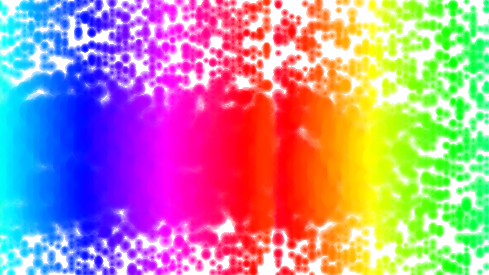

# Bubbl


A stylized limited 2D game engine.

### Dependencies
OpenGL 3.3, LuaJIT and LuaRocks, SDL2

Optional: Cargo for Rust library to generate GIFs, libpng for generating PNGs

### To-Do (never to be implemented as I'm moving on from this project)
- [x] Custom extensible graphics renderer
- [x] Modular system
- [x] Hot reloading
- [x] Web interface
- [ ] GIF generation
- [ ] Testing
- [ ] Post-processing effects
- [ ] 3-D
- [ ] More primitives
- [ ] More simulations
- [ ] More games
- [ ] Android

### Fedora Example
```bash
sudo dnf install SDL2-devel luajit-devel luarocks
./build.lua
./bubbl
```





